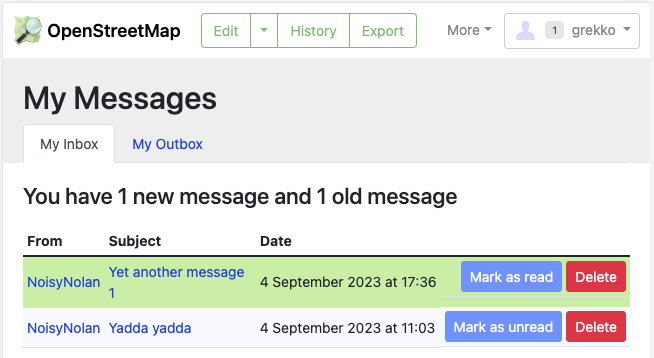
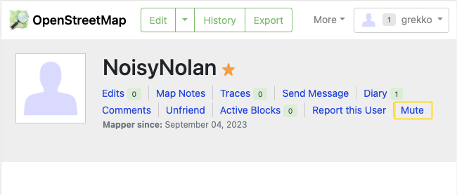
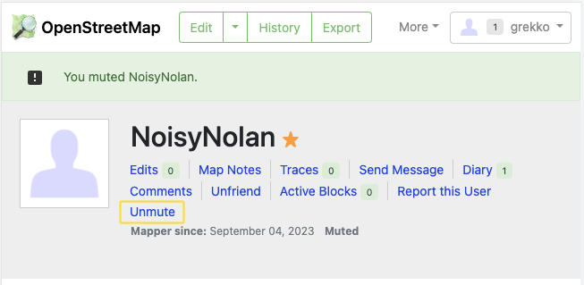
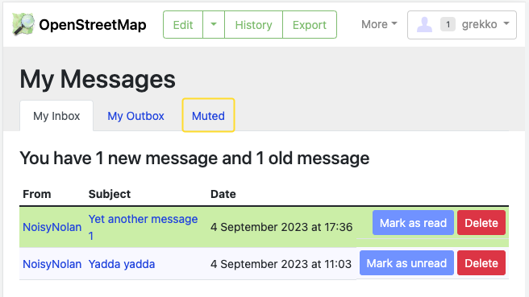
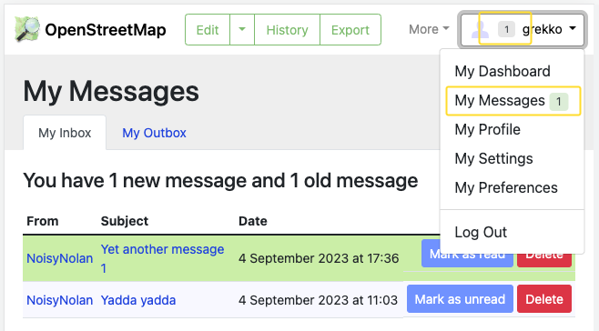
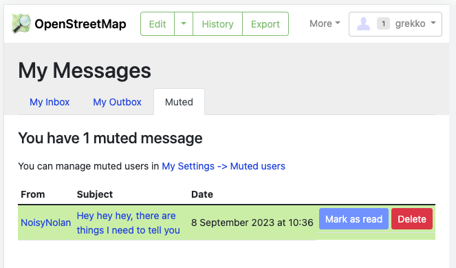
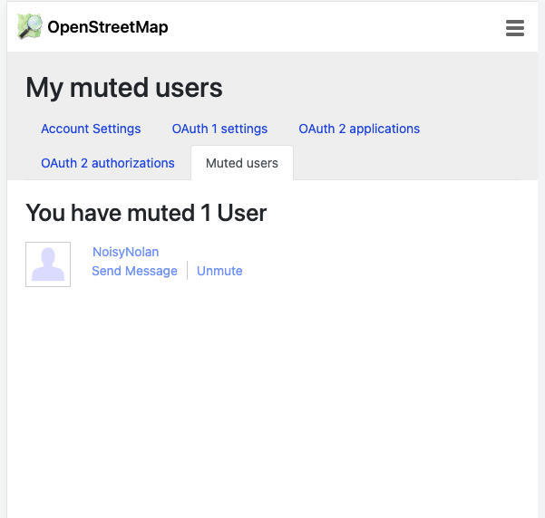
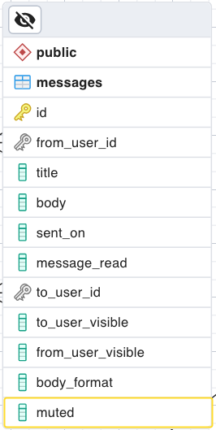
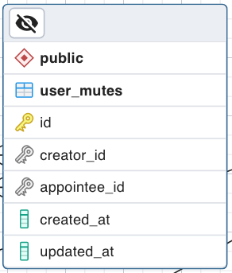

# Proposal for Mute other users

Hereby I bid on implementing the `UserMute`-Feature as described in the [README](../README.md). I've read the details regarding the proposal process and scoring criteria on the [OSM Foundation EWG Project site](https://wiki.osmfoundation.org/wiki/Engineering_Working_Group/Project_Funding_Framework) and hope to provide all the information with this document for you to process my bid.

If any relevant information is missing please do not hesitate to reach out to me via <github.com@grekko.de>.

## About the author

I myself am not an OSM user and am not associated in any capacity to the project yet. I was introduced to the EWG Project Funding by a friend who is an active OSM contributor. I briefly met Andy Allan in a virtual meeting who outlined his thoughts on the  `UserMute`-Feature. With that input I started to write down this bid.

I've been working on Rails web applications since 2011, freelancing as a Rails developer since 2016. I have been working mostly in small teams, usually in a "Full Stack" capacity. I will do 100% of the implementation work outlined in this bid.

## General thoughts & concept

I examined the OSM Website codebase and think the desired behaviour could be implemented by a few additions to the existing data model, some CRUD operations to manage a `UserMute`-model which encapsulates the Feature and some UI adjustments.

The following section outlines some possible User Flows.

Let me know if you need any more details e.g. about the data model changes I intend or CRUD operations which I think are required to implement the User Flows.

## Wireframes and User Flows

I'll describe the main User Flow for the `User-Mute` feature using 2 imaginative users. The user `grekko` as a placeholder for any other user who finds themselve in a situation in which the second user – `Noisy Nolan` – is overwhelming them with private messages.

_The following images are screenshots I've manufactured by running the OSM Website rails application on my computer and adjusting the HTML to illustrate how I imagine the UI._

### Step1: User is overwhelmed by private messages from another user

User grekko received multiple private messages from Noisy Nolan and feels overwhelmed at this point.

The UI for user grekko onto the `My messages`-screen at `/messages/inbox`.

### Step2: grekko mutes NoisyNolan

grekko navigates to Noisy Nolans user page (`/user/NoisyNolan`), e.g. by clicking on the `display_name` on the `My messages`-screen.

The Mute action is confirmed – "You muted NoisyNolan" – from now on all private messages sent by Noisy Nolan will be flagged as `muted`.

grekko could `Unmute` NoisyNolan here again – the `Mute`-link changed into a `Unmute`-link.

### Step3: Noisy Nolan sends another private message

Since Noisy Nolan is muted by and for grekko:

- No Email Notification is sent to grekko for new private messages sent by Noisy Nolan
- Muted private messages are displayed in a new separate Tab – titled "Muted" – on the `My messages`-screen
  - Muted private messages should still be accessible but be displayed not as prominent as non-muted private messages
  - The Tab is only visible once there is at least 1 muted Message

- The message badges – displayed in the Usermenu on the top-right of the screen – still displays `1` and not `2` (here in this screenshot the "Muted"-Tab should also be displayed)

### Step4: Inspecting/managing _muted_ message

grekko can still access the muted message from Noisy Nolan through the new `Muted`-Tab in `My Message`. When opening the `Tab`:

- A list of all muted Messages is displayed
  - Muted Messages can be read, deleted and replied to. They are technically no different from non-muted messages
- A link to the Mute settings page is displayed. Here users can manage review and manage their user-mutes

### Step5: The Mute settings page

- A list of all muted users is displayed
- Individual users can be unmuted from here

Here is also a good place to add a small text block explaining e.g. that users with the `Administrator`- or `Moderator`-role overrule the mute logic. Private messages sent from such users are NOT flagged as `muted` even if users muted them.

## Notes on the Scoring criteria

On the [OSM Foundation EWG Project site](https://wiki.osmfoundation.org/wiki/Engineering_Working_Group/Project_Funding_Framework) several criteria are mentioned which each bid is scored against. I want to briefly describe my perspective and plans regarding these.

### Documentation

All code and/or data model changes I'll introduce will be documented to a degree which will have to be negotiated when the Pull Request with my changes reaches the OSM Website repository. 

For now I can provide documentation for the intended data model changes.

a) The existing `Message`-data model should be extended with a `muted`-flag `(boolean, NOT NULL, default: false)`

b) A new `UserMute`-data model will describe the `mute`-relation:

### Automated Tests

I've noticed that the OSM Website Codebase contains different types of automated software tests for the application logic (model tests, controller tests, system tests and so on).

I will provide a full set of automated tests for each of those types at least to the degree that existing features are covered by such tests.

### Costs

The Proposal Process mentions

> Bids must be reasonably priced. Bids with an unusually high cost or an unrealistically low cost may be rejected.

At this point in the process many relevant variables which might impact the effort & time I'll have to put into the process of the implementation are unknown to me.

So please understand that I have to speculate here. When just considering my work on the actual implementation I estimate that I'll have to spend between 4 to 8 days of 8h working days into the implementation, documentation, tests and so on.