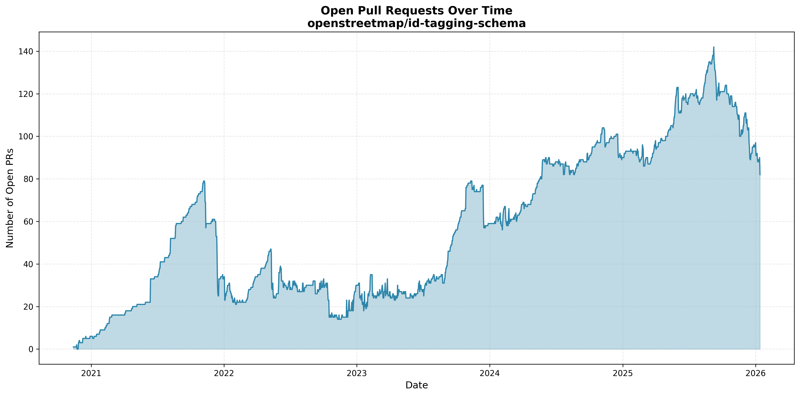

## Summary

I am proposing to work on reviewing [iD](https://github.com/openstreetmap/iD/) and [iD tagging schema](https://github.com/openstreetmap/id-tagging-schema/) pull requests and issues. Currently many are waiting for review, often unreasonably long. As result it is one of significant bottlenecks for improving this software, wastes already done work and discourages potential contributors.

I would be also working on implementing uncontroversial improvements to iD tagging schema in form of own PRs.

Note that this is unsolicited proposal, not responding to any proposal call. I am therefore fully aware that budget may be unavailable or that general idea will be considered as fine but with someone else getting funded. And if money can be spend better I am entirely fine with both.

I am already doing it as a volunteer, but would like to spend more time on it.

This proposed work would be a paid one if this proposal would be accepted, with cost would be heavily discounted from my normal rate and set to minimum UK wage.

## Involved projects

iD is one of the most widely used OpenStreetMap editors and is deployed at osm.org

iD tagging schema is a machine-readable description of OSM tagging schema
iD tagging schema powers [iD, Rapid, Every Door, Go Map!!, StreetComplete editors and is used also by Panoramax, Overpass Turbo and more](https://github.com/openstreetmap/id-tagging-schema/wiki/Projects-that-are-using-this-tagging-schema). Overall, large part of humans editing in OSM will use this presets in some way.

Both of iD and iD tagging schema are maintained by Martin Raifer (supported by OpenStreetMap Foundation) and some volunteer maintainers.

Currently they have in total over 200 open pull requests and over 1300 open issues. See https://github.com/openstreetmap/iD/pulls and https://github.com/openstreetmap/id-tagging-schema/pulls and https://github.com/ideditor/schema-builder/pulls and issue listings.

## Why more triaging would be a good idea

Currently in some cases processing PRs takes years. Often by the time PR is finally reviewed original author is no longer willing to process feedback. Oldest waiting ones are 5+ years old.

This is currently one of the main bottlenecks to development of this software. People that want to contribute, would implement something and open pull request. But often it would not help as, as PR would only gather dust and sit without being processed.

Timely processing of incoming pull requests also increases chance that people will contribute again. If good pull requests are merged it also reduces barriers to implementation of features wanted by community.

It is likely also cost-effective compared to paid developer implementing bugfixes and features themselves. Though as pull requests are often about low priority issues this may of more limited benefit.

Over last months I was significantly helping with review of such waiting contributions, especially PRs in iD tagging schema repository.

## Examples of my work

https://github.com/openstreetmap/id-tagging-schema/pull/1569 - I identified mergeable PR (thanks to novolife for implementing it!), performed necessary testing. PR was merged, this should make presets a bit better especially for mappers active in Asia once new iD version is released.

https://github.com/openstreetmap/id-tagging-schema/pull/1505 - I identified mergeable PR (thanks to piperswe for implementing it!), performed necessary testing, and confirmed with community that it is a welcome change. This PR also got merged.

https://github.com/openstreetmap/id-tagging-schema/pull/1868 - I reviewed PR and gave feedback to PR author. Hopefully it will result in improvements.

https://github.com/openstreetmap/id-tagging-schema/pull/1805 - I closed PR that was sadly not worth keeping.

https://github.com/openstreetmap/id-tagging-schema/pull/1849 - I implemented bugfix, now also was merged.

https://github.com/openstreetmap/id-tagging-schema/issues/1813 - design work to simplify codebase, it was implemented (thanks Flo Edelmann), bringing us closer to fixing https://github.com/ideditor/schema-builder/issues/204

https://github.com/openstreetmap/iD/pull/10045 https://github.com/openstreetmap/iD/issues/10033 - I identified poor idea and recommended WONTFIXing it, issue and PR were closed.

https://github.com/openstreetmap/iD/issues/11620 and https://github.com/openstreetmap/iD/issues/11663 - and https://github.com/openstreetmap/iD/issues/11556 I identified more WONTFIX candidates that could be closed before someone spend time on implementing them.

https://github.com/openstreetmap/id-tagging-schema/pull/1854 - rescuing one of useful parts of old and abandoned https://github.com/openstreetmap/id-tagging-schema/pull/1159

https://github.com/openstreetmap/id-tagging-schema/pull/1831 - I implemented uncontroversial feature, PR was merged. https://community.openstreetmap.org/t/id-tagging-schema-improvements-which-would-be-especially-worth-doing-which-should-be-avoided/138538 has more ideas for potential features that I would implement if I would have time for that

### More triaging record

See https://codeberg.org/matkoniecz/id-tagging-schema-personal-triaging/src/branch/master/ready_to_merge_prs.json5 for my triaging project. This specific file is list of not yet acted on ideas that I will raise during the next meeting.

This repository contains also code of PR triaging tool and record of my triages done in preparation for the weekly meetings, to see it look at commit list.

## Proposed costs

I would be happy to spend more time on this but it is hard to justify it as volunteer hobby.

I am proposing being paid for it, I would be willing to accept rates lower than minimum UK wage, treating this heavily discounted pay as form of donation from me to OpenStreetMap Foundation. 

I was thinking about 14 GBP per hour, including all taxes - lower than UK minimum wage as paid by employer which AFAIK is about 15 GBP per hour. If OpenStreetMap Foundation needs to pay VAT/NIC/etc on UK side payment would be appropriately reduced. I would be paying in full all applicable taxes on my side.

If that proposal will not be accepted I would be happy to continue contributing entirely as a volunteer, though that makes far less likely that I will be able to contribute at high rate.

I am proposing initial trial run for 12 weeks, with average of two days per week, for total of 192 hours of work. With evaluation whether project is considered as worth continuing both from perspective of myself, iD maintainer, EWG and consensus of OpenStreetMap community - with continuation if all parties are in agreement that it is a good idea.

Time spend on editing OpenStreetMap wiki, making tagging proposals, making bot edits, discussion on OpenStreetMap forums would NOT be covered by this proposal and would NOT be paid for.

192 hours at 14 GBP per hour would bring costs to 192*14 = 2688 GBP.

## Known risks

- maybe this funds can be spend better
    * if someone has good ideas, then EWG/OSMF board is likely interested in hearing about them
- other volunteer contributors may feel discouraged if a single person is being paid and they are not
- reviewing issues and PR inherently means that some will be rejected and closed, some people may prefer them to stay untouched rather than being processed
- OSM tagging schemas are at times controversial, I may do dumb mistake or a controversial decision - and there were some tagging-related dramas in past. Though I like to believe that I am doing fairly well at judging those and avoiding bad sides of both (1) "I am God Emperor of OSM and I decided that tagging will look like this, everyone must obey my edict" and (2) being helpless and unable to declare obviously terrible idea not supported by community as something that should be WONTFIXed on sight.
    - to reduce that risk I will be focusing on less controversial tagging ideas, especially where I know or suspect that my tagging preferences diverges from community
    - https://community.openstreetmap.org/t/id-tagging-schema-improvements-which-would-be-especially-worth-doing-which-should-be-avoided/138538 was created specifically to confirm that some tasks that I identified as safe and worth doing are in fact safe

## Alternative funding

I attempted to get funding for such purpose from nlnet, but I consider success chance to be fairly low and it will take them months to either reject or approve my proposal.

If it would be succesful then I would first use up nlnet funding, then use OSMF funding once nlnet funding for given time period runs out.

## Proposal history

I got irritated/sad/frustrated looking at number of age pull requests waiting to be processed in iD tagging schema.

I located some of obviously mergeable pull requests created by other people and tested them to confirm they can and should be merged. Then I contacted iD maintainer Martin Raifer to arrange a meeting, to which they agreed (thanks!). On this first meeting we reviewed together some pull requests, and some got merged. 

Meeting was repeated again one week later to review more of actionable cases that I found. Since then we meet several times.

This consumes a lot of my time, and I wish to spend more effort on it. Unfortunately I am not independently wealthy and I need money to not be homeless and so on. So time that I can spend on unpaid hobby/volunteering is limited.

I consulted with OpenStreetMap Foundation board on a public meeting where I proposed this project, got directed to Engineering Working Group.

Then in turn I contacted also Engineering Working Group on their public meeting, where I was instructed to send mail describing my proposal. Content of that email was later reused to create this document.

In response I was invited to the next public meeting of EWG, where I proposed this proposal again. Publishing proposal on [https://github.com/osmfoundation/ewg_bidding](https://github.com/osmfoundation/ewg_bidding) and consulting wider OpenStreetMap community was decided as the next step.

Count of open pull requests on iD tagging schema repository, as of 2026-01-13 - data obtained directly after one of PR review sessions. 
I started PR review project when over 140 PRs were open and waiting. I helped with closure of many (but not all) of PRs handled since then.
